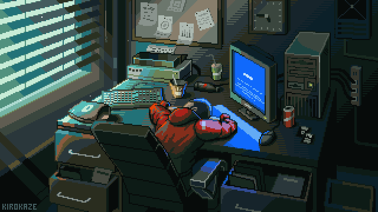

  

<h1 align="center">Hey there! I'm Dhruv Donga 👋</h1>

  

### 🚀 About Me

I’m a curious, slightly witty problem-solver who loves building things that actually help people.  
Currently pursuing my **M.S. in Computer Science at the University of Texas at Arlington**, I spend most of my time in **software development** and tinkering with **data science**. Lately, I’ve been learning **Generative AI** the way I like best **by shipping projects**.

📍 **Location:** Arlington, TX, USA 
🍜 **Foodie | Traveler | Adventurer:** If there’s good food or a new trail, I’m in.  
⚡ **Quick learner:** New stack? New tool? Hand me the docs, I’ll ship by evening.

---

### 🛠️ Tech Toolbox

  
  
  
  
  
  
  
  
  
  
  
  
  
  
  
  
  
  
  
  
  

  

---

### ✨ What I’m Into (beyond code)

- **Building for impact:** small tools, big usefulness.  
- **Food & travel:** mapping cities by taste buds and trail maps.  
- **Adventures:** new hikes, new ideas, new repos.

---

### 📈 GitHub Voyage

  

  

  

  

---

### 🤝 Let’s Connect

  <!-- Replace with your actual LinkedIn when ready -->
  
  

